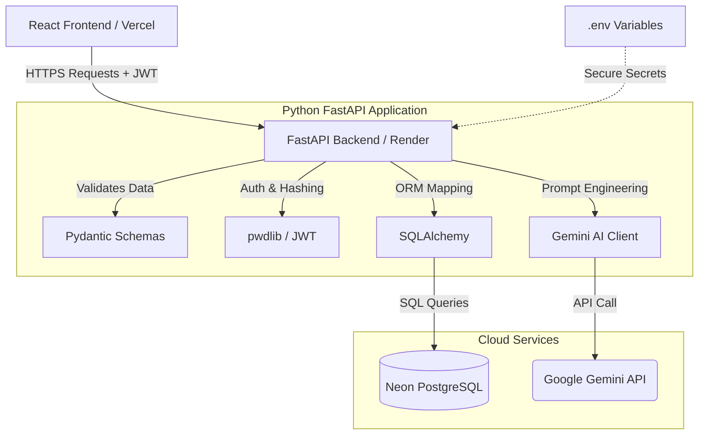

# System Architecture

FitPulse is built using a decoupled, three-tier architecture. The frontend is hosted on Vercel, the backend on Render, and the database on Neon.

## Architecture Diagram

```mermaid
graph TD
    %% Frontend
    Client[React Frontend / Vercel] -->|HTTPS Requests + JWT| API[FastAPI Backend / Render]
    
    %% Backend
    subgraph "Python FastAPI Application"
        API -->|Validates Data| Pydantic[Pydantic Schemas]
        API -->|Auth & Hashing| Auth[pwdlib / JWT]
        API -->|ORM Mapping| SQLA[SQLAlchemy]
        API -->|Prompt Engineering| AI[Gemini AI Client]
    end
    
    %% Data Layer
    subgraph "Cloud Services"
        SQLA -->|SQL Queries| DB[(Neon PostgreSQL)]
        AI -->|API Call| Gemini(Google Gemini API)
    end
    
    %% Environment
    Env[.env Variables] -.->|Secure Secrets| API
```
